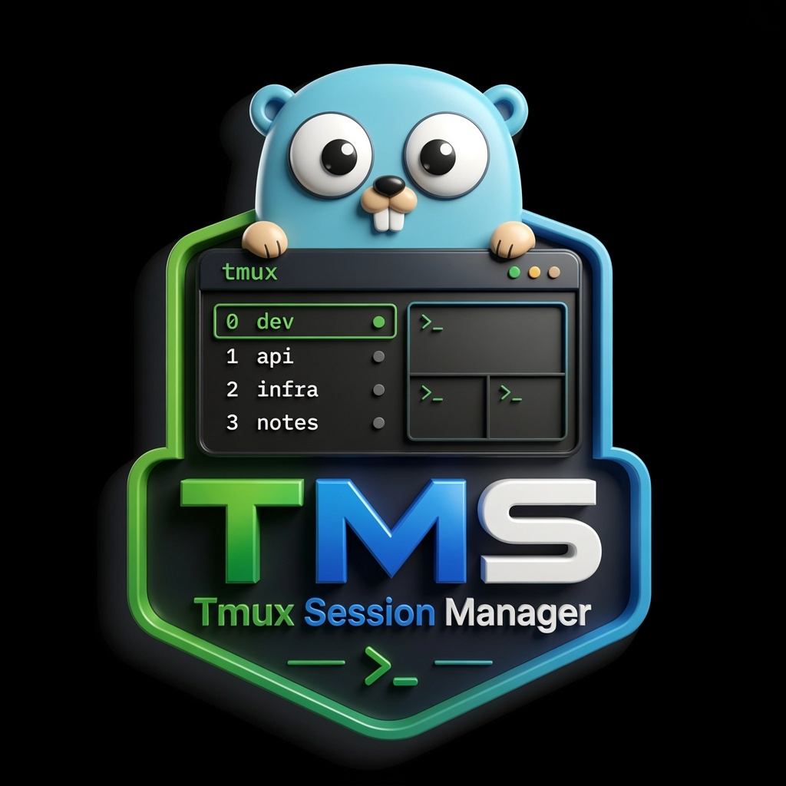

<p align="center">
  
</p>
<h1 align="center">TMS, A clean, fast, and modern tmux session manager written in Go</h1>

## About

`tms` helps you create, switch, kill, rename, and manage tmux sessions with both a beautiful **TUI** (interactive menu) and a powerful **CLI**.

## Features

- ✨ **Interactive TUI** — Launch with no arguments for an intuitive menu (powered by [Bubble Tea](https://github.com/charmbracelet/bubbletea))
- 🎯 **CLI commands** — Full support for scripting and keybindings via [Kong](https://github.com/alecthomas/kong)
- 📋 **Session management** — Create, switch, kill, rename, and list sessions
- 🗂️ **Session persistence** — Save and restore named session definitions
- ⚙️ **Configuration** — Persistent settings via `~/.config/tms/config.toml`
- 🚀 **Auto-switch** — Optionally switch to new sessions immediately
- 🎨 **Theming** — Customizable color schemes
- ⚡ **Fast & lightweight** — Single optimized Go binary, no runtime dependencies

## Installation

### From source (recommended)

```bash
git clone https://github.com/waldirborbajr/tms.git
cd tms
just build          # Compile optimized binary
just release-local  # Install to $GOPATH/bin
```

Or directly:

```bash
go install github.com/waldirborbajr/tms@latest
```

### Requirements

- Go 1.19+
- tmux 2.1+

## Usage

### Interactive Mode (TUI)

```bash
tms
```

Launch with no arguments to open the interactive menu. Navigate with arrow keys or vim keys (`j`/`k`), select with Enter, quit with `q`.

### CLI Mode

```bash
# Create a new session
tms new [name]

# Create and switch (respects auto_switch config)
tms new work

# Switch to existing session (launch interactive picker if no name given)
tms switch [name]
tms s [name]           # alias

# Kill one or more sessions (interactive multi-select if no name given)
tms kill [name]
tms k [name]           # alias

# Rename a session
tms rename <old> <new>
tms r <old> <new>      # alias

# Save a session definition for restore
tms save <name> [directory]

# Restore a saved session definition
tms restore <name>

# List saved session definitions
tms saved

# List all active sessions
tms list

# Show version info
tms version

# Show current configuration
tms config
```

## Configuration

Configuration is stored at `~/.config/tms/config.toml`. Create it with:

```toml
default_session = "main"
default_directory = ""          # Optional: start sessions in this directory
auto_switch = true              # Switch to new sessions immediately
theme = "default"               # Built-in theme (extensible)
```

On first run, `tms` creates a default config file with these settings.

## tmux Keybindings

Add these to your `~/.tmux.conf` to integrate `tms`:

```tmux
# Open tms menu
bind-key t run-shell "tms"

# Create new session
bind-key c run-shell "tms new"

# Switch to session (interactive)
bind-key s run-shell "tms switch"

# Kill sessions (interactive multi-select)
bind-key k run-shell "tms kill"

# List sessions
bind-key l run-shell "tms list"

# Rename current session (requires manual input)
bind-key r command-prompt -I "#S" -p "Rename: " \
  "run-shell 'tms rename \"#S\" \"%%\"'"
```

Then reload tmux:

```bash
tmux source-file ~/.tmux.conf
```

## Building

### Quick Build

```bash
just build          # Optimized binary (stripped, fast)
just b              # Shorthand
```

### Build Variants

```bash
just build-debug    # With debug symbols (larger)
just build-static   # Fully static binary (no libc)
just build-cross    # Multi-platform (Linux/macOS/Windows)
```

### Version Management

```bash
just version-show            # Display current version
just version-bump patch      # 1.2.3 → 1.2.4
just version-bump minor      # 1.2.3 → 1.3.0
just version-bump major      # 1.2.3 → 2.0.0
```

The version is embedded at build time via `-ldflags`.

## Development

### Project Structure

```
tms/
├── main.go           # Entry point, CLI setup
├── cli.go            # Kong CLI definitions
├── commands.go       # CLI command implementations
├── config.go         # Configuration loading
├── tmux.go           # Tmux command wrappers
├── display.go        # Shared display renderers
├── menu_model.go     # Main menu (Bubble Tea)
├── input_model.go    # Text input model
├── switch_model.go   # Session picker model
├── kill_model.go     # Multi-select kill model
├── information_model.go  # Read-only display model
├── styles.go         # Lipgloss style definitions
├── justfile          # Build recipes
└── VERSION           # Current version
```

### Testing

```bash
just test            # Run tests
just test-coverage   # With coverage report
```

### Code Quality

```bash
just fmt             # Format code
just vet             # Run go vet
just lint            # Run golangci-lint
just check           # All checks (fmt-check, vet, lint, test)
just pre-commit      # Pre-commit validation
```

### Git Workflow

```bash
just pre-commit      # Before committing
git add .
git commit -m "feat: description"
```

## Architecture

### CLI vs TUI

- **CLI mode**: Direct commands, used in scripts and tmux keybindings
- **TUI mode**: Interactive menu, launched with `tms` or when interactive input is needed

Both share the same underlying tmux operations and configuration layer.

### Error Handling

Errors are surfaced via:
- **TUI**: `TmuxDisplay()` messages shown in tmux status line
- **CLI**: Standard error output and exit codes
- **Startup**: `stderr` with fallback to defaults

### Models (Bubble Tea)

Each interactive screen is a model:
- `MenuModel` — Main menu
- `InputModel` — Text input for session names
- `SwitchModel` — Interactive session picker
- `KillModel` — Multi-select kill interface
- `InformationModel` — Read-only display (version, config, list)

## Dependencies

- `github.com/charmbracelet/bubbletea` — TUI framework
- `github.com/charmbracelet/lipgloss` — Terminal styling
- `github.com/alecthomas/kong` — CLI argument parsing
- `github.com/BurntSushi/toml` — Configuration file parsing

All dependencies are vendored and managed by `go mod`.

## Contributing

Contributions are welcome! Please follow these guidelines:

1. **Fork** the repository
2. **Create a feature branch** (`git checkout -b feature/my-feature`)
3. **Make changes** following the code style
4. **Run `just check`** to validate code quality
5. **Write or update tests** as needed
6. **Submit a Pull Request** with a clear description

### Code Style

- Follow Go conventions and `gofmt`
- Receiver names match type initials: `k` for `KillModel`, `s` for `SwitchModel`, `t` for `TextInputModel`
- Keep error handling explicit; avoid silent failures
- Surgical changes only; don't refactor unrelated code

### Testing

Tests should verify:
- Model `Update()` logic with various `tea.KeyMsg` inputs
- Config loading and defaults
- Tmux command wrappers and error cases

## License

MIT — See `LICENSE` file

## Credits

Built with:
- [Bubble Tea](https://github.com/charmbracelet/bubbletea) for TUI magic
- [Lipgloss](https://github.com/charmbracelet/lipgloss) for beautiful styling
- [Kong](https://github.com/alecthomas/kong) for effortless CLI parsing

Made with ❤️ for the terminal.

---

**Questions?** Open an issue or discussion on GitHub.
