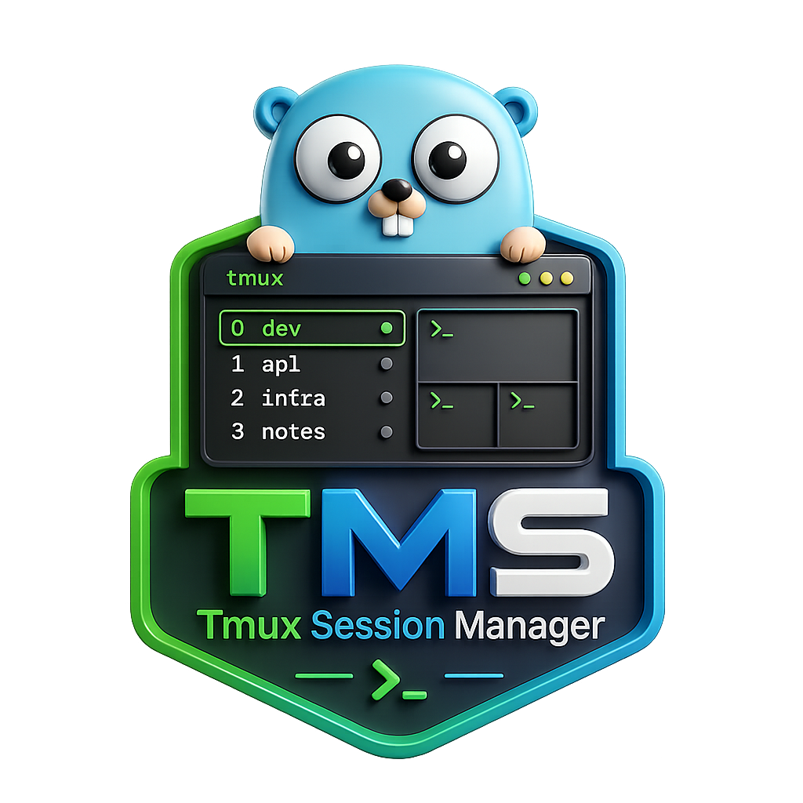

# tms

<p align="center">
  
</p>

Tmux Session Manager

```
go get github.com/charmbracelet/lipgloss
go get github.com/alecthomas/kong
go get github.com/charmbracelet/bubbletea
go get github.com/BurntSushi/toml
```

### how to use?

```
tms --help
tms version
tms ls
tms new dev
tms k              # atalho para kill (interactive)
tms k main
tms r oldname newname
```

```
# Build com informações do Git e data
go build -ldflags="-s -w \
  -X main.Version=1.2.0 \
  -X main.GitCommit=$(git rev-parse --short HEAD) \
  -X main.BuildTime=$(date -u '+%Y-%m-%dT%H:%M:%SZ')" \
  -o tms
```

```
just build          # ou just b
just release-local  # instala localmente
just version        # não existe ainda, mas você pode usar ./bin/tms version
```

```
just version-bump patch     # 1.2.3 → 1.2.4
just version-bump minor     # 1.2.3 → 1.3.0
just version-bump major     # 1.2.3 → 2.0.0
```

```
bind-key t run-shell "tms"                    # Menu principal (futuro)
bind-key C run-shell "tms new"                # Nova sessão
bind-key s run-shell "tms switch"             # Switch (melhor que attach)
bind-key K run-shell "tms kill"               # Kill interativo
bind-key R command-prompt -I "#S" -p "New name: " "run-shell 'tms rename \"#S\" \"%%\"'"
bind-key L run-shell "tms list"
```


